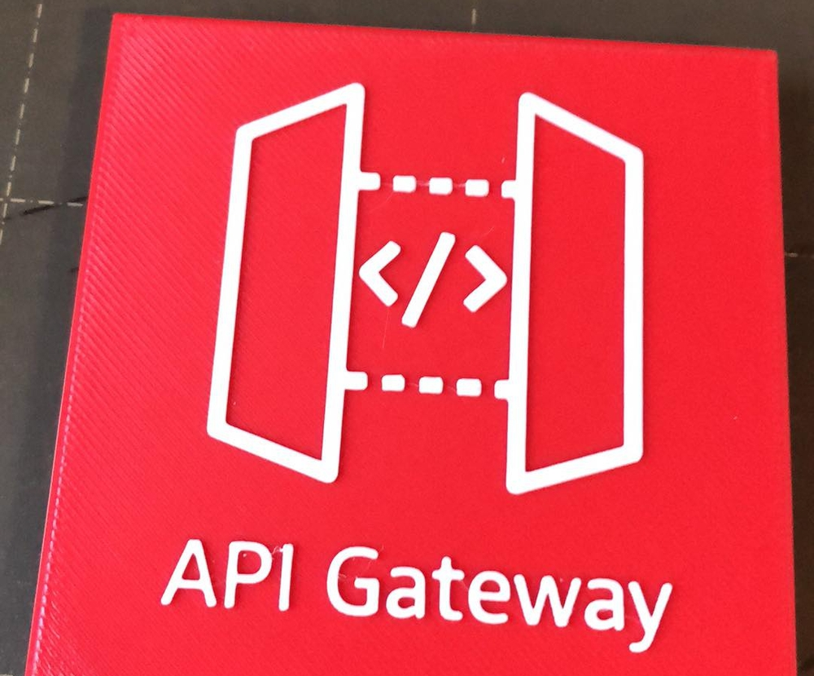
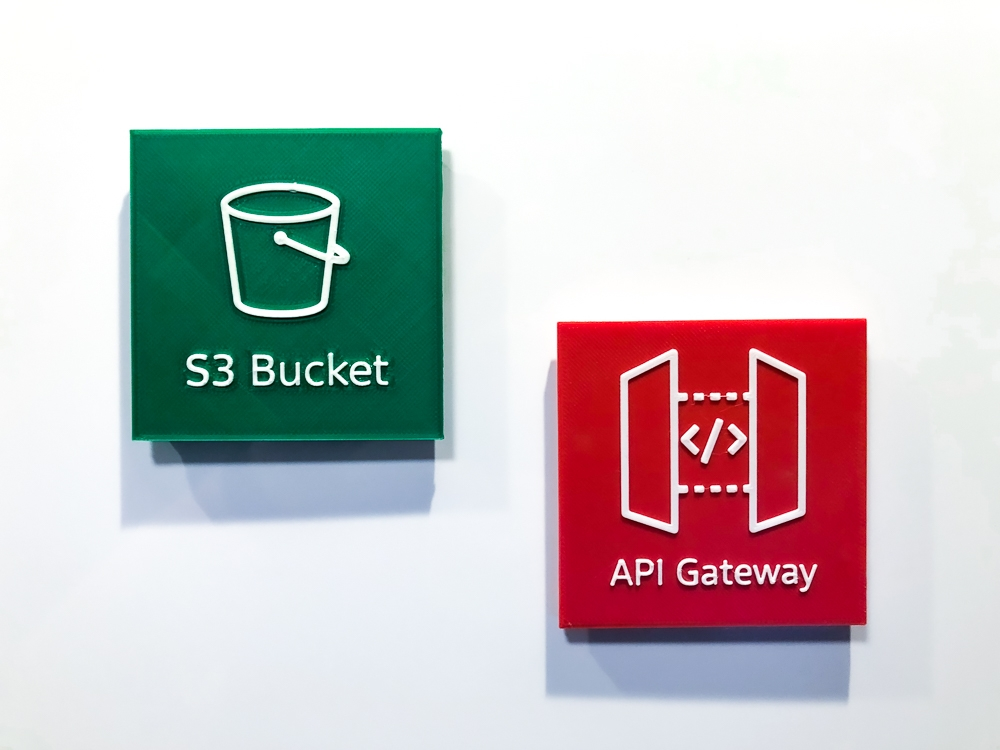
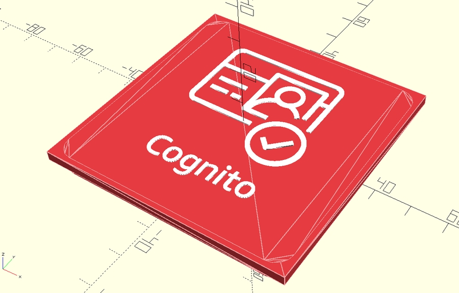
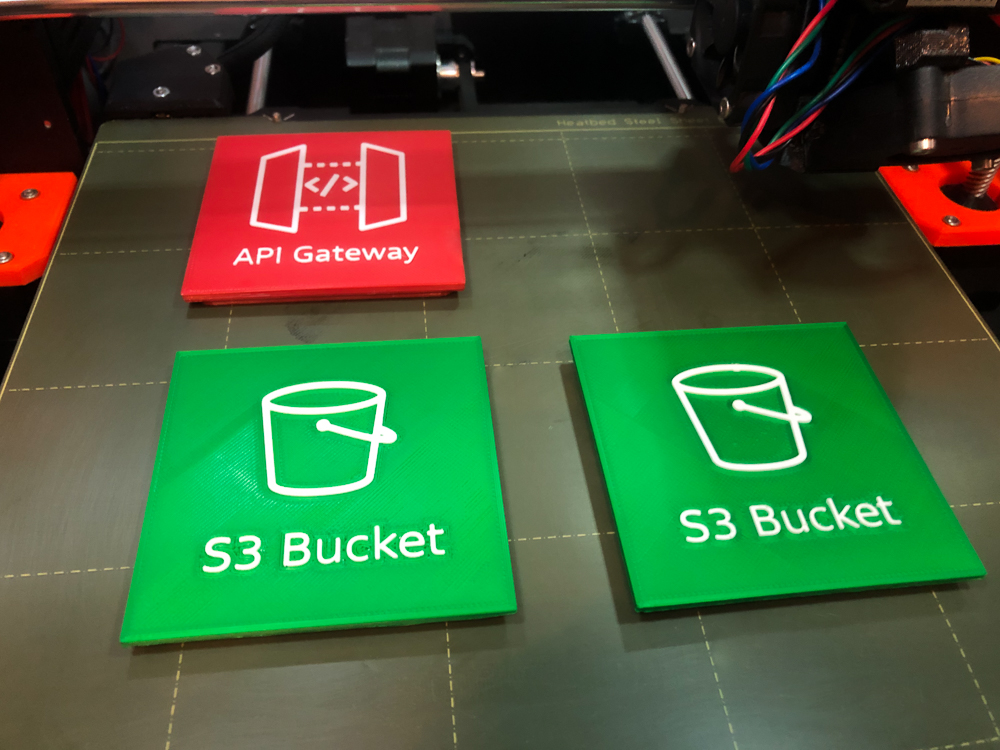
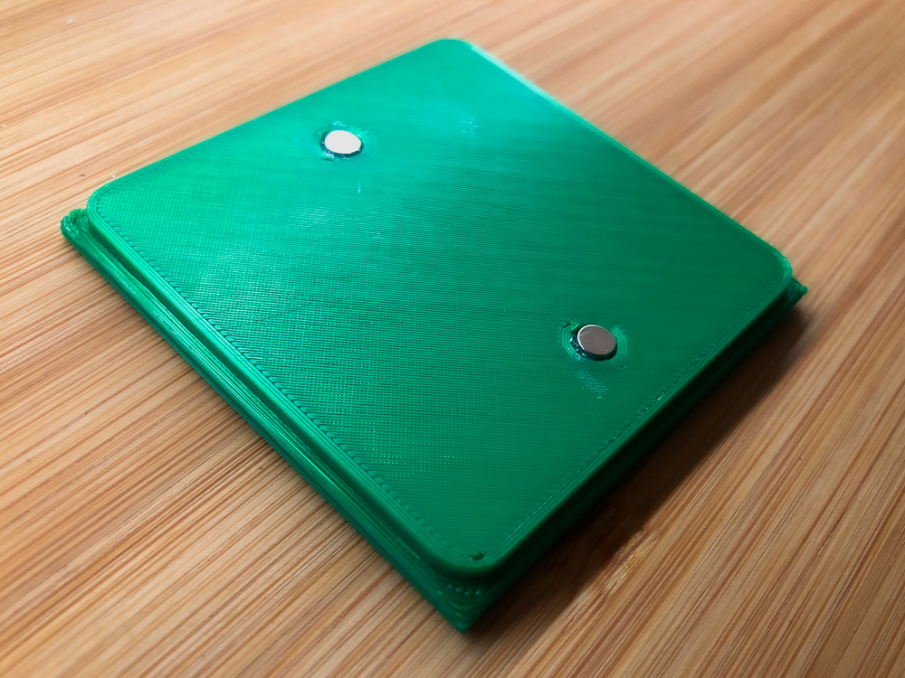

<meta name="twitter:card" content="summary_large_image">
<meta name="twitter:site" content="@vjirovsky">
<meta name="twitter:creator" content="@vjirovsky">
<meta name="twitter:description" content="3D models for AWS cloud services to be printed as magnet for whiteboards">
<meta name="twitter:image" content="https://vjirovsky.github.io/cloudmagnets-aws/images/usage/social.png">
<!-- Global site tag (gtag.js) - Google Analytics -->

## Overview

  

Do you draw a cloud architecture diagrams on a whiteboard and are you a lousy painter as me?

I wanted to speed up my work and make it more readable - so I have designed my custom magnets of mostly used AWS services and printed them on a 3D printer. Now, when you design an architecture diagram on a whiteboard, it's easier and nobody complains about my painting skill.

All models are in STL format, ready to be printed with multi-material 3D printer (like *Prusa MMU2S*) - originally designed in OpenSCAD.

In `_print_exports/` folder are optimized ready-to print `.3mf` projects.

Do you prefer Azure over AWS? No problem, <a href="https://vjirovsky.github.io/cloudmagnets-az/">check out the Azure version</a>.

## BOM
- PLA filaments, all icons require *2* colors: *white* + service type color
- for every icon you need *2pcs* of neodymium magnets *5x2mm* ([Aliexpress link](https://www.aliexpress.com/item/1005002226582762.html?))
- glue

## Photos 
 

## Available icons



## Printer settings

All models requires maximum *5* colors at once. For my printing I used PLA material, also test with ABS looked pretty good.

- **Resolution**: 0.15mm
- **Supports**: Yes
- **Infill**: 15%

## Assembly instructions

1. print icons on 3D printer
1. prepare neodymium magnets, glue
1. check magnets sides - in case you want to stock magnets, check you glue magnets in same pole in every icon
1. glue magnets into holes

## Support or Contact

Have you found any issue or do you want to request another service icon to be created? Please [create a new issue on GitHub](https://github.com/vjirovsky/cloudmagnets-aws/issues).
